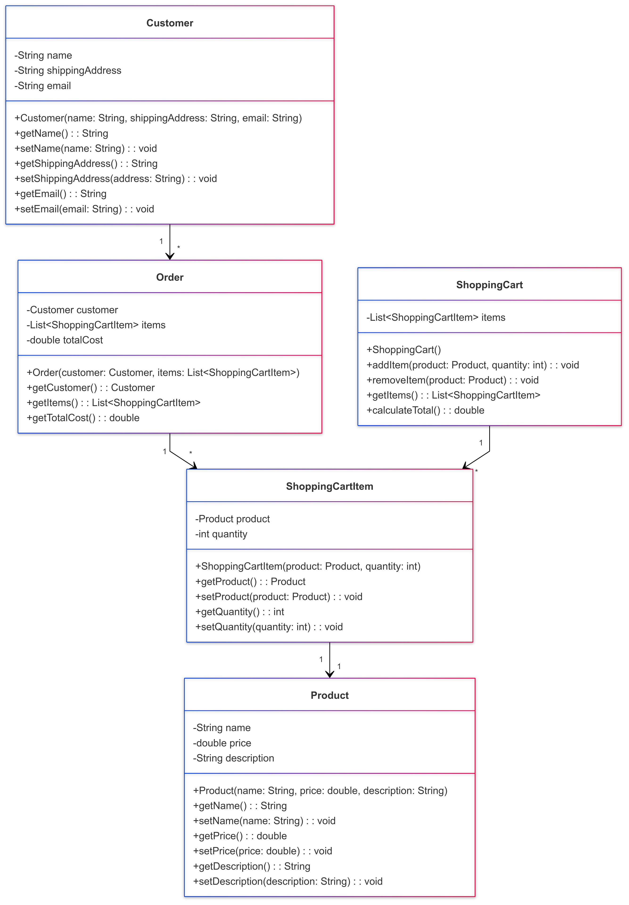

# Store Project

## Overview
The **Store Project** is a simple Java application that models a store system with functionalities for managing customers, products, shopping carts, and orders. This project demonstrates basic object-oriented programming (OOP) principles and interactions between different classes.




## Features
- Manage customers with details such as name, shipping address, and email.
- Define products with attributes like name, price, and description.
- Add products to a shopping cart with specified quantities.
- Calculate the total cost of items in the shopping cart.
- Create orders containing customer details and cart items.

## Classes and Responsibilities

### 1. `Customer`
Represents a registered customer.
- **Attributes:** `name`, `shippingAddress`, `email`
- **Methods:** Getters, setters, and constructor.

### 2. `Product`
Models a product in the store.
- **Attributes:** `name`, `price`, `description`
- **Methods:** Getters, setters, and constructor.

### 3. `ShoppingCartItem`
Represents a product added to the shopping cart with its quantity.
- **Attributes:** `product`, `quantity`
- **Methods:** Getters, setters, and constructor.

### 4. `ShoppingCart`
Tracks selected products and their quantities.
- **Attributes:** List of `ShoppingCartItem`
- **Methods:** Add/remove items, calculate total cost.

### 5. `Order`
Represents a finalized order.
- **Attributes:** `customer`, list of `ShoppingCartItem`, `totalCost`
- **Methods:** Constructor, getters.

### 6. `Main`
The entry point of the application.
- Demonstrates the creation of customers, products, shopping carts, and orders.
- Outputs shopping cart details and order summary.

## Usage
1. Clone the repository:
   ```bash
   git clone <repository-url>
   ```
2. Open the project in your preferred IDE (e.g., IntelliJ, Eclipse).
3. Run the `Main` class to execute the application.

## Example Output
```
Shopping Cart:
Laptop x 1
Mouse x 2
Keyboard x 1
Total: $1300.00

Order Summary:
Customer: Alice
Shipping Address: 123 Main St
Order Items:
Laptop x 1
Mouse x 2
Keyboard x 1
Total Cost: $1300.00
```

## Requirements
- Java 8 or later.

## Author
- Victor da Costa Almada

## License
This project is licensed under the MIT License.
